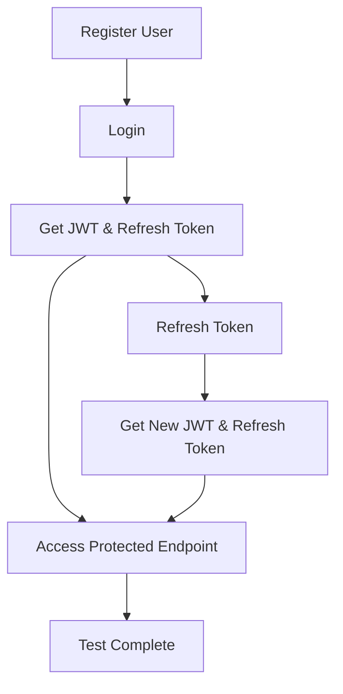

# Authentication Tests for Social Network Backend

This directory contains comprehensive tests for the authentication features of the social network backend API.

## Test Files

### 1. `auth_test.php`
A standalone integration test that validates all authentication endpoints:

**Features Tested:**
- ✅ User Registration (`POST /api/register`)
- ✅ Input Validation (email format, password length, required fields)
- ✅ Duplicate User Prevention  
- ✅ User Login (`POST /api/login`)
- ✅ JWT Token Generation
- ✅ Token Refresh (`POST /api/token/refresh`)
- ✅ Token Rotation Security
- ✅ Protected Endpoint Access (`GET /api/profile`)
- ✅ Unauthorized Access Prevention
- ✅ Error Handling and Status Codes

**Usage:**
```bash
# Run directly with PHP
php tests/auth_test.php

# Or use the test runner script  
./tests/run_auth_tests.sh
```

### 2. `run_auth_tests.sh`
Automated test runner that:
- Starts the Symfony development server
- Sets up the database (if available)
- Runs all authentication tests
- Provides colored output and detailed results
- Cleans up after completion

### 3. Test Configuration Files
- `phpunit.xml` - PHPUnit configuration (for future expansion)
- `bootstrap.php` - Test bootstrapping script

## Authentication Flow Testing

The tests validate the complete authentication flow:



## Test Results Format

Each test returns structured results:
```php
[
    'test' => 'Test Name',
    'success' => true|false,
    'status' => HTTP_STATUS_CODE,
    'response' => API_RESPONSE,
    // Additional context based on test type
]
```

## Prerequisites

Before running tests, ensure:

1. **PHP Version**: PHP 8.2+ (current system has 8.1 - see Known Issues)
2. **JWT Keys**: Generated in `config/jwt/` directory
3. **Database**: Configured and migrated
4. **Environment**: `.env.local` file configured

## Known Issues

⚠️ **PHP Version Mismatch**: The current system has PHP 8.1.2, but the project requires PHP 8.2+. This prevents:
- Running Symfony console commands
- Using Doctrine migrations
- Starting the development server properly

**Workarounds:**
- Tests are designed to work with any HTTP server serving the API
- Manual database setup may be required
- Consider using Docker for consistent PHP 8.2+ environment

## Manual Testing

If the automated tests can't run due to PHP version issues, you can manually test with cURL:

### 1. Register User
```bash
curl -X POST http://localhost:8000/api/register \
  -H "Content-Type: application/json" \
  -d '{"email": "test@example.com", "password": "testpass123"}'
```

### 2. Login
```bash
curl -X POST http://localhost:8000/api/login \
  -H "Content-Type: application/json" \
  -d '{"email": "test@example.com", "password": "testpass123"}'
```

### 3. Access Protected Endpoint
```bash
curl -X GET http://localhost:8000/api/profile \
  -H "Authorization: Bearer YOUR_JWT_TOKEN"
```

### 4. Refresh Token
```bash
curl -X POST http://localhost:8000/api/token/refresh \
  -H "Content-Type: application/json" \
  -d '{"refresh_token": "YOUR_REFRESH_TOKEN"}'
```

## Security Features Verified

The tests validate these security measures:

1. **Input Validation**: Email format, password strength
2. **Authentication**: Proper credential verification
3. **Authorization**: JWT token validation
4. **Token Security**: Secure token generation and rotation
5. **Error Handling**: Appropriate error responses
6. **Access Control**: Protected endpoints require authentication

## Expanding Tests

To add more test cases:

1. Add new test methods to `AuthTest` class
2. Follow the existing pattern for request/response validation
3. Update the `runAllTests()` method to include new tests
4. Document new tests in this README

## Contributing

When modifying authentication tests:
- Ensure all tests are independent
- Validate both success and failure cases
- Test edge cases and security boundaries
- Maintain backwards compatibility